# Veloz Platform

Veloz is a quick-commerce startup delivering groceries and everyday
essentials in 15–45 minutes, running about 30 dark stores across Medellín,
Bogotá, and São Paulo — roughly 450 riders, ~180,000 orders a month, and
about to expand into two more cities.

This repository is Veloz's data platform: a local, single-machine pipeline
that pulls in orders, rider location/status events, store fulfillment
reports, and payment/commission files, cleans and reconciles them, and
turns them into dashboards and daily reports for Operations and Finance.

It runs entirely on one laptop or one machine using Docker — no cloud
account, no dedicated infrastructure team required.

## The problem this solves

Today, everything is manual:

- **Operations** finds out a store is falling behind, or a rider has gone
  dark, only when a customer complains — not before.
- **Finance** reconciles rider payouts by hand every day, which is slow and
  error-prone. A rider was recently underpaid for days before anyone
  noticed.
- There's a single analyst running SQL queries by hand each morning. If
  that person is out sick, nothing gets checked.

This platform automates all of that: it ingests the raw data on a
schedule, checks it for problems, and produces two things people can
actually rely on:

1. **A near-live view** for Ops of order and rider status, store by store
   (minutes-old, not hours-old).
2. **A daily reconciliation report** for Finance, ready before their 8am
   standup, that clearly flags any numbers that don't add up instead of
   silently guessing which source is "right."

## How it works — Architecture overview

```mermaid
flowchart TB
    %% ============ EXTERNAL / UPSTREAM ============
    subgraph EXT["External upstream sources — fixed, fully specified (docs/data-sources.md)"]
        direction LR
        ORD["Orders\nPostgres periodic extract\n(created→assigned→picked_up→delivered/cancelled)"]
        RID["Rider app events\nqueue stream\n(location pings, status changes)"]
        FUL["Store fulfillment\none CSV/store/day, emailed\n(unreliable: missing/malformed)"]
        PAY["Payments / commissions\ndaily ledger file\n(settlement-lag pattern)"]
    end

    %% ============ ORCHESTRATION ============
    subgraph AF["Airflow 3.3.1 — docker-compose, LocalExecutor"]
        direction LR
        AFAPI["airflow-apiserver\nUI + REST API + execution API\n:8080"]
        AFSCHED["airflow-scheduler\nschedules DAG runs,\nAsset/trigger evaluation"]
        AFDAGP["airflow-dag-processor\nparses DAG files\n(split out of scheduler in Airflow 3)"]
        AFTRIG["airflow-triggerer\nasync deferred triggers\n(S3NewObjectTrigger for Bronze DAGs)"]
    end

    PGDB[("postgres\nAirflow metadata DB\n(NOT a data-lake store —\njust Airflow's own state)")]
    AFAPI --- PGDB
    AFSCHED --- PGDB
    AFDAGP --- PGDB
    AFTRIG --- PGDB

    %% Generator DAGs simulate the upstream systems, writing raw files into MinIO
    subgraph GENDAGS["Generator DAGs — simulate upstream systems, built"]
        direction LR
        GORD["generate_orders_and_rider_events\nevery 5 min"]
        GFUL["generate_fulfillment\ndaily"]
        GPAY["generate_payments\ndaily"]
    end

    ORD -. "emulated by" .-> GORD
    RID -. "emulated by" .-> GORD
    FUL -. "emulated by" .-> GFUL
    PAY -. "emulated by" .-> GPAY

    AFSCHED --> GORD
    AFSCHED --> GFUL
    AFSCHED --> GPAY

    %% ============ COMPUTE ============
    subgraph SPARK["Spark Standalone cluster — shared compute, built"]
        direction LR
        SPMASTER["spark-master\nschedules jobs across workers\nUI :8090"]
        SPWORK["spark-worker x N\n(SPARK_WORKER_COUNT, default 5)\ncapped cores/memory per worker"]
        SPMASTER --- SPWORK
    end

    subgraph BRONZEDAGS["Bronze ingestion DAGs — Asset/S3-trigger scheduled"]
        direction LR
        IORD["ingest_orders_bronze\ntriggered on new object\nunder orders/, built"]
        IRID["ingest_rider_events_bronze\ntriggered on new object\nunder rider_events/, built\n(temporary batch stand-in\nfor the streaming design below)"]
        IFUL["ingest_fulfillment_bronze\nquarantines missing files +\nmalformed rows, built"]
        IPAY["ingest_payments_bronze\nnot yet built"]
    end

    AFTRIG -. "watches for new S3 objects" .-> IORD
    AFTRIG -. "watches for new S3 objects" .-> IRID
    AFSCHED --> IFUL
    AFSCHED -.-> IPAY

    IORD --> SPMASTER
    IRID --> SPMASTER
    IFUL --> SPMASTER
    IPAY -.-> SPMASTER

    subgraph KAFKASTREAM["Streaming path — reference design, not yet built"]
        direction LR
        KAFKA["Kafka (KRaft) + Kafka UI\nrider-event producer"]
        SSTREAM["Spark Structured Streaming\ncheckpointed, watermarked\nconsumer"]
        KAFKA --> SSTREAM
    end

    RID -. "future producer wiring" .-> KAFKA
    SSTREAM -. "streaming write, will replace\ningest_rider_events_bronze" .-> SPMASTER

    %% ============ STORAGE HUB ============
    subgraph MINIO["MinIO — S3-compatible object storage, central storage hub, built"]
        direction TB
        RAWBUCKET[("raw-incoming-data\nlanding zone for all 4\ngenerator outputs")]
        BRONZEBUCKET[("bronze-veloz\nschema-applied,\nappend-only per extract")]
        SILVERBUCKET[("silver-veloz\ndeduplicated,\nquarantine-clean,\nreconciled")]
        GOLDBUCKET[("gold-veloz\nreconciliation +\ndashboard-ready aggregates")]
    end

    GORD -- "writes CSV/JSONL" --> RAWBUCKET
    GFUL -- "writes CSV" --> RAWBUCKET
    GPAY -- "writes CSV" --> RAWBUCKET

    SPMASTER -- "reads raw/*, writes\nschema-applied Delta" --> BRONZEBUCKET
    BRONZEBUCKET -. "Silver DAGs — not yet built\n(dedup, quarantine collapse)" .-> SILVERBUCKET
    SILVERBUCKET -. "Gold DAGs — not yet built\n(reconciliation, aggregates)" .-> GOLDBUCKET

    %% Two IAM roles enforced at the MinIO layer
    IAMNOTE["Two IAM roles via minio-init:\nveloz-ingest (read/write/list, no delete) — default for DAGs\nveloz-maintenance (full CRUD) — OPTIMIZE/VACUUM only"]
    MINIO -.- IAMNOTE

    %% ============ INTERACTIVE / DEV ============
    subgraph JUP["Jupyter — optional notebook, built"]
        JLAB["jupyter lab :8888\nsame image as Airflow,\nnotebooks/ against MinIO over s3a://"]
    end
    JLAB -- "ad hoc reads/writes\n(root creds, scoped bucket)" --> MINIO

    %% ============ OUTPUTS ============
    subgraph OUT["Stakeholder-facing outputs — not yet built"]
        direction LR
        OPSVIEW["Ops status view (Marcela)\nstore/rider status,\na few minutes' lag"]
        FINVIEW["Finance reconciliation report\n(Julián) — ready before 8am,\ndiscrepancies flagged, not hidden"]
    end

    GOLDBUCKET -.-> OPSVIEW
    GOLDBUCKET -.-> FINVIEW

    %% ============ STYLING ============
    classDef external fill:#fde2e2,stroke:#b91c1c,color:#000
    classDef orchestration fill:#e0f2fe,stroke:#0369a1,color:#000
    classDef compute fill:#dcfce7,stroke:#15803d,color:#000
    classDef storage fill:#fef9c3,stroke:#a16207,color:#000
    classDef output fill:#ede9fe,stroke:#6d28d9,color:#000
    classDef notbuilt stroke-dasharray: 5 5

    class ORD,RID,FUL,PAY external
    class AFAPI,AFSCHED,AFDAGP,AFTRIG,PGDB,GORD,GFUL,GPAY,IORD,IRID,IFUL orchestration
    class IPAY orchestration,notbuilt
    class SPMASTER,SPWORK,JLAB compute
    class KAFKA,SSTREAM compute,notbuilt
    class RAWBUCKET,BRONZEBUCKET,IAMNOTE storage
    class SILVERBUCKET,GOLDBUCKET storage,notbuilt
    class OPSVIEW,FINVIEW output,notbuilt
```



This diagram shows every container in the local Docker stack and how data
moves between them: the four fixed upstream sources (red) are emulated by
generator DAGs that land raw files in MinIO, Airflow (blue) schedules Spark
jobs (green) to ingest that data through Bronze → Silver → Gold storage
layers (yellow), and the Gold layer feeds the Ops and Finance-facing outputs
(purple). Solid boxes/arrows are built and running today; dashed ones —
Silver, Gold, the streaming path, and the stakeholder-facing views — are
designed but not yet built.

For the full breakdown of each component, the legend, and exactly what's
built versus designed, see
[`docs/architecture-diagram.md`](docs/architecture-diagram.md).

## Quick start

### Prerequisites

- [Docker](https://www.docker.com/) and Docker Compose (v2, bundled with
  Docker Desktop)
- Python 3.14 (only needed if you want to run tests or scripts outside of
  Docker)
- ~8 GB of free RAM for Docker (the platform runs several services plus a
  small Spark cluster locally)

### Steps

1. Clone the repository and move into it:

   ```bash
   git clone <repo-url>
   cd veloz-platform
   ```

2. Start everything:

   ```bash
   docker compose up -d
   ```

   The first run builds the Airflow/Spark image, which can take a few
   minutes. Subsequent starts are fast.

3. Wait for the services to become healthy:

   ```bash
   docker compose ps
   ```

   Everything should show `healthy` or `running`. `airflow-init` is
   expected to run once and exit — that's normal.

4. Open the Airflow UI at **http://localhost:8080** and log in with:

   - **Username:** `admin`
   - **Password:** `veloz-local-dev`

   (These come from `.env` — change them there if you want different
   local credentials.)

### What's running

| Service | What it does | Where to look |
|---|---|---|
| Airflow (scheduler, api-server, dag-processor) | Schedules and runs every pipeline | http://localhost:8080 |
| Spark cluster (1 master + workers) | Does the actual data processing | http://localhost:8090 |
| MinIO | Local stand-in for Amazon S3 — stores raw and processed data | http://localhost:9001 |
| PostgreSQL | Airflow's own internal metadata database | internal only |
| Jupyter (optional) | Notebook for exploring data by hand | http://localhost:8888 |

### Running a pipeline

Pipelines in this project are Airflow DAGs. Most run automatically on a
schedule, but you can trigger one manually to see it work end to end:

1. In the Airflow UI, find a DAG such as `ingest_orders_bronze`.
2. Un-pause it (DAGs start paused by default) using the toggle on the
   left.
3. Click the "Trigger DAG" (play) button to run it once immediately.
4. Watch the task boxes turn green as each step completes, or click into a
   task to read its logs if something goes red.

## Architecture (plain-language version)

### Where the data comes from

| Source | What it is | How it arrives |
|---|---|---|
| **Orders** | The lifecycle of each order (created → assigned → picked up → delivered/cancelled) | Periodic exports from the app's order database |
| **Rider events** | Rider location pings and status changes | A continuous stream of events (like a live feed) |
| **Fulfillment reports** | One spreadsheet per store per day, summarizing what happened | Emailed CSV files — occasionally late or malformed |
| **Payments** | Daily file of rider payouts and commissions | A daily batch file from the finance system |

The full technical spec for each source lives in
[`docs/data-sources.md`](docs/data-sources.md).

### The three-layer pipeline

Data moves through three stages, each one a little more polished than the
last:

1. **Raw data** ("Bronze") — exactly what arrived, unmodified, kept for
   audit purposes. If something upstream was wrong, this layer proves it.
2. **Cleaned data** ("Silver") — duplicates removed, types fixed,
   inconsistent formats normalized, so different sources can be compared
   against each other.
3. **Ready to report** ("Gold") — the numbers Ops and Finance actually
   look at: store-by-store status, rider status, and the daily
   reconciliation report.

### The tools involved

- **Apache Spark** does the heavy lifting — reading, cleaning, joining,
  and summarizing data.
- **Apache Airflow** schedules and coordinates all of that work, retries
  it automatically if something fails, and gives you one place to see
  what ran, what's late, and what broke.
- **MinIO** stores the data files, acting as a local drop-in replacement
  for Amazon S3 (so the same code would work against real S3 later with
  no rewrite).

Everything — Spark, Airflow, and the storage — runs on a single machine
inside Docker containers. There is no separate cluster to provision or
pay for. That keeps this proportionate to a one-person data team while
still working the same way it would at a larger scale.

## Key constraints

These come directly from how the business operates, not from arbitrary
engineering preference:

- **Speed for Ops** — a store falling behind or a rider going dark needs
  to be visible within a few minutes, not after a customer complains.
- **A trustworthy morning number for Finance** — the daily reconciliation
  report must be ready before 8am local time, with no one babysitting it
  overnight.
- **Disagreements are shown, not hidden** — if two data sources disagree
  (e.g., orders say a delivery happened but fulfillment doesn't), the
  report flags the discrepancy instead of silently picking one side.
- **Runs on one machine** — there's no dedicated infrastructure or on-call
  team behind this, so everything has to be recoverable and low-maintenance
  by design.

## Project structure

```
dags/                Airflow workflows — the pipelines that actually run
application/          Core data-processing logic (use cases), independent of Airflow/Spark specifics
infrastructure/       Adapters — Spark I/O, S3/MinIO access, Airflow-specific glue
data/                 Local file storage used by the platform (raw/processed data)
docker/               Docker images and configuration for Airflow, MinIO, etc.
docs/                 Technical reference docs, including the full data source spec
generators/           Emulators that produce realistic upstream data for local development
notebooks/            Jupyter notebooks for ad hoc data exploration
plugins/              Airflow plugin code, shared Spark session helpers
tests/                Automated tests
```

For the full schema and business-rule details behind each upstream data
source, see [`docs/data-sources.md`](docs/data-sources.md).

## Troubleshooting & next steps

- **Monitor pipelines:** the Airflow UI at http://localhost:8080 is the
  main place to check — it shows every DAG run, its status, and how long
  it took.
- **Read logs:** click into any task in the Airflow UI and open its "Logs"
  tab, or check the `logs/` directory on disk if a service won't start.
- **Check the Spark cluster:** http://localhost:8090 shows active Spark
  jobs and worker health.
- **Check MinIO storage:** http://localhost:9001 (login:
  `minioadmin` / `veloz-local-dev` unless overridden in `.env`) lets you
  browse the raw, cleaned, and reporting data directly.
- **Deeper technical reference:** see [`docs/`](docs) for architecture
  decisions ([`docs/ADR.md`](docs/ADR.md)), the data source spec
  ([`docs/data-sources.md`](docs/data-sources.md)), and diagrams
  ([`docs/architecture-diagram.md`](docs/architecture-diagram.md)).

If a service won't come up, run `docker compose ps` to see which
container is unhealthy, then `docker compose logs <service-name>` to see
why.
