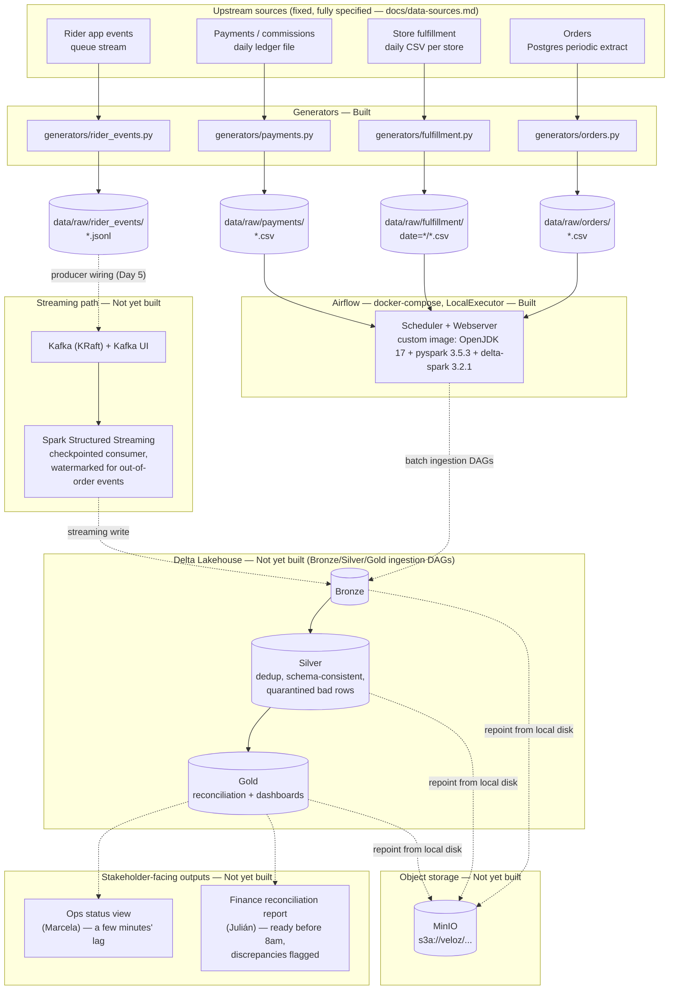

# Veloz Platform — Architecture Diagram

Reflects the reference architecture in `CLAUDE.md` plus actual build status
from `PROGRESS.md` as of 2026-08-27. Solid boxes/arrows are built and
verified; dashed boxes/arrows are designed but not yet built.

## Legend

| Style | Meaning |
|---|---|
| Solid box, solid arrow | Built and verified (generators smoke-tested; Airflow stack brought up and confirmed end-to-end via `spark_delta_smoke_test`) |
| Dashed box, dashed arrow | Designed in `CLAUDE.md`'s reference architecture, not yet built |

## What's built vs. what's next

- **Built:** all four data-source generators (`generators/orders.py`,
  `fulfillment.py`, `payments.py`, `rider_events.py`), writing to
  `data/raw/` on local disk; Airflow local-dev (LocalExecutor,
  docker-compose, custom image with Spark/Delta baked in) — up and verified,
  currently running only a smoke-test DAG.
- **Not yet built:** the actual Bronze→Silver→Gold ingestion DAGs, MinIO
  object storage (currently local disk), Kafka + the streaming consumer, and
  both stakeholder-facing outputs (Ops status view, Finance reconciliation
  report). These make up the "Platform build" table in `PROGRESS.md` and are
  the engineer's own work per `CLAUDE.md`'s current operating model.

Source of truth for exact status: `PROGRESS.md`. Source of truth for why
each architectural choice was made: `docs/ADR.md`.
