# Veloz Platform — Architecture Diagram

Container-level view of the local-dev stack (`docker-compose.yml`) plus the
Bronze/Silver/Gold lakehouse it feeds. Reflects actual build status as of
`PROGRESS.md` (2026-09-02): solid boxes/arrows are built and verified;
dashed boxes/arrows are designed (per `CLAUDE.md`'s reference architecture)
but not yet built. For the higher-level "what's done vs. what's next"
narrative, see the previous version of this document's history or
`PROGRESS.md` directly — this file focuses on the container/service
topology and data flow.

```mermaid
flowchart TB
    %% ============ EXTERNAL / UPSTREAM ============
    subgraph EXT["External upstream sources — fixed, fully specified (docs/data-sources.md)"]
        direction LR
        ORD["Orders\nPostgres periodic extract\n(created→assigned→picked_up→delivered/cancelled)"]
        RID["Rider app events\nqueue stream\n(location pings, status changes)"]
        FUL["Store fulfillment\none CSV/store/day, emailed\n(unreliable: missing/malformed)"]
        PAY["Payments / commissions\ndaily ledger file\n(settlement-lag pattern)"]
    end

    %% ============ ORCHESTRATION ============
    subgraph AF["Airflow 3.3.1 — docker-compose, LocalExecutor"]
        direction LR
        AFAPI["airflow-apiserver\nUI + REST API + execution API\n:8080"]
        AFSCHED["airflow-scheduler\nschedules DAG runs,\nAsset/trigger evaluation"]
        AFDAGP["airflow-dag-processor\nparses DAG files\n(split out of scheduler in Airflow 3)"]
        AFTRIG["airflow-triggerer\nasync deferred triggers\n(S3NewObjectTrigger for Bronze DAGs)"]
    end

    PGDB[("postgres\nAirflow metadata DB\n(NOT a data-lake store —\njust Airflow's own state)")]
    AFAPI --- PGDB
    AFSCHED --- PGDB
    AFDAGP --- PGDB
    AFTRIG --- PGDB

    %% Generator DAGs simulate the upstream systems, writing raw files into MinIO
    subgraph GENDAGS["Generator DAGs — simulate upstream systems, built"]
        direction LR
        GORD["generate_orders_and_rider_events\nevery 5 min"]
        GFUL["generate_fulfillment\ndaily"]
        GPAY["generate_payments\ndaily"]
    end

    ORD -. "emulated by" .-> GORD
    RID -. "emulated by" .-> GORD
    FUL -. "emulated by" .-> GFUL
    PAY -. "emulated by" .-> GPAY

    AFSCHED --> GORD
    AFSCHED --> GFUL
    AFSCHED --> GPAY

    %% ============ COMPUTE ============
    subgraph SPARK["Spark Standalone cluster — shared compute, built"]
        direction LR
        SPMASTER["spark-master\nschedules jobs across workers\nUI :8090"]
        SPWORK["spark-worker x N\n(SPARK_WORKER_COUNT, default 5)\ncapped cores/memory per worker"]
        SPMASTER --- SPWORK
    end

    subgraph BRONZEDAGS["Bronze ingestion DAGs — Asset/S3-trigger scheduled"]
        direction LR
        IORD["ingest_orders_bronze\ntriggered on new object\nunder orders/, built"]
        IRID["ingest_rider_events_bronze\ntriggered on new object\nunder rider_events/, built\n(temporary batch stand-in\nfor the streaming design below)"]
        IFUL["ingest_fulfillment_bronze\nquarantines missing files +\nmalformed rows, built"]
        IPAY["ingest_payments_bronze\nnot yet built"]
    end

    AFTRIG -. "watches for new S3 objects" .-> IORD
    AFTRIG -. "watches for new S3 objects" .-> IRID
    AFSCHED --> IFUL
    AFSCHED -.-> IPAY

    IORD --> SPMASTER
    IRID --> SPMASTER
    IFUL --> SPMASTER
    IPAY -.-> SPMASTER

    subgraph KAFKASTREAM["Streaming path — reference design, not yet built"]
        direction LR
        KAFKA["Kafka (KRaft) + Kafka UI\nrider-event producer"]
        SSTREAM["Spark Structured Streaming\ncheckpointed, watermarked\nconsumer"]
        KAFKA --> SSTREAM
    end

    RID -. "future producer wiring" .-> KAFKA
    SSTREAM -. "streaming write, will replace\ningest_rider_events_bronze" .-> SPMASTER

    %% ============ STORAGE HUB ============
    subgraph MINIO["MinIO — S3-compatible object storage, central storage hub, built"]
        direction TB
        RAWBUCKET[("raw-incoming-data\nlanding zone for all 4\ngenerator outputs")]
        BRONZEBUCKET[("bronze-veloz\nschema-applied,\nappend-only per extract")]
        SILVERBUCKET[("silver-veloz\ndeduplicated,\nquarantine-clean,\nreconciled")]
        GOLDBUCKET[("gold-veloz\nreconciliation +\ndashboard-ready aggregates")]
    end

    GORD -- "writes CSV/JSONL" --> RAWBUCKET
    GFUL -- "writes CSV" --> RAWBUCKET
    GPAY -- "writes CSV" --> RAWBUCKET

    SPMASTER -- "reads raw/*, writes\nschema-applied Delta" --> BRONZEBUCKET
    BRONZEBUCKET -. "Silver DAGs — not yet built\n(dedup, quarantine collapse)" .-> SILVERBUCKET
    SILVERBUCKET -. "Gold DAGs — not yet built\n(reconciliation, aggregates)" .-> GOLDBUCKET

    %% Two IAM roles enforced at the MinIO layer
    IAMNOTE["Two IAM roles via minio-init:\nveloz-ingest (read/write/list, no delete) — default for DAGs\nveloz-maintenance (full CRUD) — OPTIMIZE/VACUUM only"]
    MINIO -.- IAMNOTE

    %% ============ INTERACTIVE / DEV ============
    subgraph JUP["Jupyter — optional notebook, built"]
        JLAB["jupyter lab :8888\nsame image as Airflow,\nnotebooks/ against MinIO over s3a://"]
    end
    JLAB -- "ad hoc reads/writes\n(root creds, scoped bucket)" --> MINIO

    %% ============ OUTPUTS ============
    subgraph OUT["Stakeholder-facing outputs — not yet built"]
        direction LR
        OPSVIEW["Ops status view (Marcela)\nstore/rider status,\na few minutes' lag"]
        FINVIEW["Finance reconciliation report\n(Julián) — ready before 8am,\ndiscrepancies flagged, not hidden"]
    end

    GOLDBUCKET -.-> OPSVIEW
    GOLDBUCKET -.-> FINVIEW

    %% ============ STYLING ============
    classDef external fill:#fde2e2,stroke:#b91c1c,color:#000
    classDef orchestration fill:#e0f2fe,stroke:#0369a1,color:#000
    classDef compute fill:#dcfce7,stroke:#15803d,color:#000
    classDef storage fill:#fef9c3,stroke:#a16207,color:#000
    classDef output fill:#ede9fe,stroke:#6d28d9,color:#000
    classDef notbuilt stroke-dasharray: 5 5

    class ORD,RID,FUL,PAY external
    class AFAPI,AFSCHED,AFDAGP,AFTRIG,PGDB,GORD,GFUL,GPAY,IORD,IRID,IFUL orchestration
    class IPAY orchestration,notbuilt
    class SPMASTER,SPWORK,JLAB compute
    class KAFKA,SSTREAM compute,notbuilt
    class RAWBUCKET,BRONZEBUCKET,IAMNOTE storage
    class SILVERBUCKET,GOLDBUCKET storage,notbuilt
    class OPSVIEW,FINVIEW output,notbuilt
```

## Legend

| Style | Meaning |
|---|---|
| Solid box, solid arrow, colored fill | Built and running in `docker-compose.yml` / verified end-to-end |
| Dashed box, dashed arrow | Designed in `CLAUDE.md`'s reference architecture or `PROGRESS.md`'s build table, not yet built |
| Color: red | External upstream systems (fixed, cannot be modified) |
| Color: blue | Orchestration (Airflow services, DAGs) |
| Color: green | Compute (Spark cluster, Jupyter) |
| Color: yellow | Storage (MinIO buckets, IAM roles) |
| Color: purple | Stakeholder-facing outputs |

## Component roles

- **PostgreSQL (`postgres`)** — Airflow's own metadata database only
  (DAG run state, task instances, connections/variables). It is not part of
  the data lakehouse; none of the four business data sources are stored
  here. The "Orders" upstream source is a *separate*, conceptually distinct
  Postgres system this project doesn't run a container for — it's emulated
  by the `generate_orders_and_rider_events` DAG writing directly to MinIO.
- **Airflow services** — split across four containers in Airflow 3's
  topology: `airflow-apiserver` (UI + REST + execution API, port 8080),
  `airflow-scheduler` (evaluates schedules and Asset conditions, dispatches
  task runs), `airflow-dag-processor` (parses DAG files, split out of the
  scheduler as of Airflow 3), and `airflow-triggerer` (runs async deferred
  triggers — critically, `S3NewObjectTrigger`, which watches MinIO for new
  objects and fires the Bronze ingestion DAGs event-driven rather than on a
  fixed cron).
- **Spark Standalone cluster (`spark-master` + `spark-worker` x N)** — the
  shared compute layer every Bronze/Silver/Gold DAG submits jobs to.
  `spark-master` schedules applications across the worker pool
  (`SPARK_WORKER_COUNT`, default 5, configurable per `.env`); each worker's
  CPU/memory is capped via Docker resource limits and passed as its own
  `--cores`/`--memory` flags so it never advertises more than its container
  actually has. No dedicated cluster beyond this — deliberately, per G5 (no
  platform-team-sized infra for a one-person data team).
- **MinIO** — the central storage hub, S3-compatible, standing in for AWS
  S3 (G4: nothing needs re-pointing when this outgrows one machine). Four
  buckets: `raw-incoming-data` (landing zone for all four generator
  outputs, distinct from the three Delta layers below), `bronze-veloz`,
  `silver-veloz`, `gold-veloz`. Two IAM roles are bootstrapped by the
  one-shot `minio-init` container: `veloz-ingest` (read/write/list, no
  delete — what every ingestion DAG uses by default) and
  `veloz-maintenance` (full CRUD, reserved for deliberate `OPTIMIZE`/
  `VACUUM` runs), so a bug in a DAG can overwrite a Delta commit but cannot
  destroy the historical files behind it.
- **Jupyter (`jupyter`)** — optional, for interactive exploration against
  the real MinIO stack over `s3a://`. Same image as the Airflow containers
  (already has pyspark/delta-spark/mc installed); not part of the
  scheduled pipeline.

## Where data enters the system

All four upstream sources are fixed and fully specified
(`docs/data-sources.md`) but not literally run as separate services here —
each is emulated by a generator script (`generators/orders.py`,
`rider_events.py`, `fulfillment.py`, `payments.py`) invoked by its own
Airflow "generator DAG" (`generate_orders_and_rider_events`,
`generate_fulfillment`, `generate_payments`). These generator DAGs write
raw files directly into MinIO's `raw-incoming-data` bucket, in the same
folder/key layout a real upstream landing zone would use — this is the
system's actual entry point.

## How data flows through the three layers

1. **Landing (`raw-incoming-data`)** — generator DAGs write raw
   CSV/JSONL files here, partitioned by date (and, for orders/rider
   events, by 5-minute window). This is a fourth bucket distinct from the
   Bronze/Silver/Gold layers, standing in for "what actually arrived from
   upstream, unmodified."
2. **Bronze (`bronze-veloz`)** — event/schema-driven ingestion DAGs
   (`ingest_orders_bronze`, `ingest_rider_events_bronze`,
   `ingest_fulfillment_bronze`; `ingest_payments_bronze` not yet built)
   submit Spark jobs to the Standalone cluster, which read the raw files,
   apply an explicit schema (fail loudly on drift, never `inferSchema`),
   and write append-only Delta tables partitioned by extract date. Orders
   and rider events are triggered event-driven, off `S3NewObjectTrigger`-
   watched Airflow Assets, firing as soon as a new window-file lands.
   Fulfillment additionally quarantines two failure modes at this stage
   (missing store files, malformed rows) since `docs/data-sources.md`
   documents that feed as unreliable by design.
3. **Silver (`silver-veloz`)** — not yet built. Will deduplicate orders
   into one row per order (collapsing repeated extract-window states),
   collapse fulfillment into one row per store/sku/date, and resolve
   quarantined rows.
4. **Gold (`gold-veloz`)** — not yet built. Will hold the Finance
   reconciliation (recomputed commission vs. actual payout, flagged not
   hidden) and Ops-facing aggregates.

The rider-events source is architected (per `CLAUDE.md`'s reference table)
to eventually run through Kafka + Spark Structured Streaming instead of
batch Bronze ingestion, for G1's near-live Ops visibility.
`ingest_rider_events_bronze` is an explicit, documented temporary stand-in
reusing the same Bronze/Asset plumbing as orders, not a replacement for
that streaming design.

## Where the output goes

Gold-layer tables are the source for the two stakeholder-facing outputs
that are not yet built: an Ops status view (store/rider status, a few
minutes of lag, for Marcela) and a Finance reconciliation report (ready
before Julián's 8am standup, with discrepancies flagged rather than
silently resolved one way or the other). Both read from `gold-veloz`, not
from Bronze or Silver directly — nothing stakeholder-facing bypasses the
reconciliation/aggregation step.

Source of truth for exact build status: `PROGRESS.md`. Source of truth for
why each architectural choice was made: `docs/ADR.md`.
