# Veloz Platform — Architecture Diagram

High-level view of the platform's core technologies and how data flows
between them. This is the diagram to show a stakeholder in 10 seconds:
sources come in, Airflow orchestrates, Spark processes, MinIO stores the
result in three layers, and the Gold layer feeds Ops/Finance outputs.

```mermaid
flowchart LR
    subgraph SRC["External sources"]
        direction TB
        ORD["Orders"]
        RID["Rider events"]
        FUL["Fulfillment"]
        PAY["Payments"]
    end

    AF["Airflow\norchestration"]
    SPARK["Spark\ncompute"]

    subgraph LAKE["MinIO — object storage"]
        direction TB
        BRONZE[("Bronze\nraw, schema-applied")]
        SILVER[("Silver\ndeduplicated, reconciled")]
        GOLD[("Gold\ndashboard-ready")]
        BRONZE --> SILVER --> GOLD
    end

    subgraph OUT["Stakeholder outputs"]
        direction TB
        OPSVIEW["Ops status view"]
        FINVIEW["Finance reconciliation"]
    end

    SRC --> AF --> SPARK --> BRONZE
    GOLD --> OUT

    classDef external fill:#fde2e2,stroke:#b91c1c,color:#000
    classDef orchestration fill:#e0f2fe,stroke:#0369a1,color:#000
    classDef compute fill:#dcfce7,stroke:#15803d,color:#000
    classDef storage fill:#fef9c3,stroke:#a16207,color:#000
    classDef output fill:#ede9fe,stroke:#6d28d9,color:#000

    class ORD,RID,FUL,PAY external
    class AF orchestration
    class SPARK compute
    class BRONZE,SILVER,GOLD storage
    class OPSVIEW,FINVIEW output
```

**What this leaves out:** individual DAG names, IAM role names, MinIO
bucket names, the Kafka/streaming path for rider events, generator-script
details, and Jupyter. Those live at the container/service level, not the
architecture level a stakeholder needs. For that full topology — every
Airflow service, the Spark Standalone cluster, exact bucket names, IAM
roles, and what's built versus still designed — see
[`docs/architecture-topology.md`](architecture-topology.md).

## Legend

| Color | Meaning |
|---|---|
| Red | External sources (fixed, cannot be modified) |
| Blue | Orchestration (Airflow) |
| Green | Compute (Spark) |
| Yellow | Storage (MinIO — Bronze/Silver/Gold) |
| Purple | Stakeholder-facing outputs |

## What the layers mean

- **External sources** — Orders, rider events, store fulfillment, and
  payments/commissions. Fixed and fully specified upstream systems; see
  `docs/data-sources.md`.
- **Airflow** — schedules and triggers the pipeline end to end.
- **Spark** — does the actual data processing (schema application,
  deduplication, reconciliation).
- **MinIO (Bronze → Silver → Gold)** — the object-storage lakehouse.
  Bronze holds raw, schema-applied data; Silver is deduplicated and
  reconciled; Gold is dashboard/report-ready.
- **Stakeholder outputs** — the Ops status view and Finance reconciliation
  report, both read from Gold only.

Source of truth for exact build status: `PROGRESS.md`. Source of truth for
why each architectural choice was made: `docs/ADR.md`.
