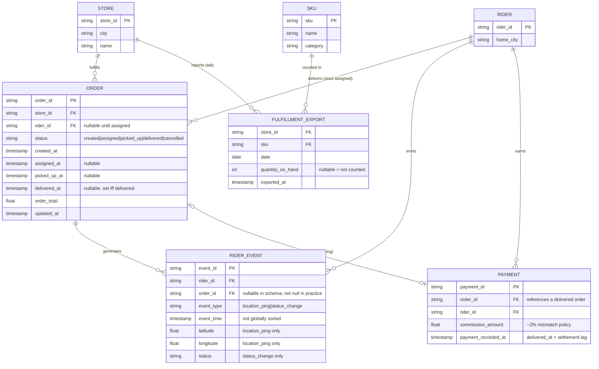

# Veloz Data Sources — Entity-Relationship Diagram

Logical ER view of the four upstream sources documented in
`docs/data-sources.md`, plus the shared reference dimensions
(`generators/reference_data.py`) they're generated against.

This is a **logical**, not a physical, ER diagram: the four sources are
independent operational systems (Postgres extract, queue stream, emailed
CSVs, a finance ledger file) with no enforced foreign keys or shared
database between them. The relationships below are the join keys the
Bronze → Silver → Gold pipeline uses to relate them — several are
intentionally partial (nullable, optional, or lossy), per the business
rules in `docs/data-sources.md`. Cardinalities reflect the documented
business rules, not an assumption.

## Notes on the non-obvious relationships

| Relationship | Why it's drawn this way |
|---|---|
| `RIDER \|\|--o{ ORDER` | `rider_id` on `ORDER` is null until the order reaches `assigned` — a rider "delivers" zero or many orders, but the FK only resolves from that lifecycle point on. |
| `ORDER \|\|--o{ RIDER_EVENT` | Only orders that reach `assigned` or further produce events at all; an order stuck at `created` has zero. Events are also not globally time-sorted per `docs/data-sources.md` — a real stream-ordering issue, not a diagram artifact. |
| `ORDER \|o--o\| PAYMENT` | Modeled as optional-to-optional: every `PAYMENT.order_id` should reference a `delivered` order, but ~1% of delivered orders have **no** payment row at all (a documented data-quality gap, not a schema violation) — this is exactly the discrepancy Finance's reconciliation (G2) needs to surface, not silently drop. |
| `STORE \|\|--o{ FULFILLMENT_EXPORT`, `SKU \|\|--o{ FULFILLMENT_EXPORT` | `FULFILLMENT_EXPORT` has no single-column PK — it's one row per `(store_id, sku, date)`, and ~10% of store/date files are missing entirely, ~15% arrive with corrupted rows (`--bad-night`, seeded). |
| `STORE`, `RIDER`, `SKU` as separate dimension entities | None of the four raw sources ships a stores/riders/SKUs table — they're shared reference dimensions built once in `generators/reference_data.py` (30 stores, 450 riders, 33 SKUs) that every generator draws IDs from, which is what makes the cross-source joins valid in the first place. |

Source of truth for exact column types, business rules (commission tiers,
settlement lag, `--bad-night` rates) and generator status:
`docs/data-sources.md`. This diagram is a structural companion to that
document, not a replacement for it.
